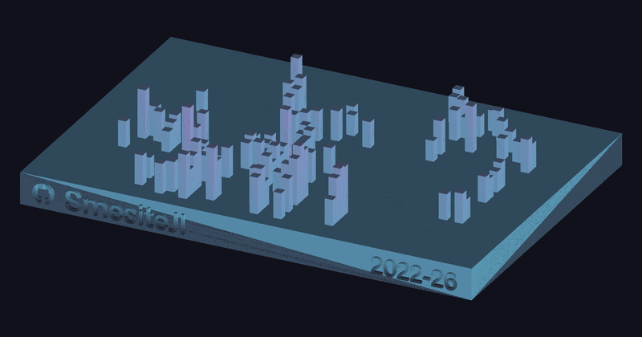

## About

Backend developer from Kazan, studying at **KFU / ITIS**. I build services that other people have to
run in production, which mostly means caring about the parts nobody notices while they work.

- **End to end on a feature** — REST contract, domain model, schema migration, integration tests on real containers, and the metrics that show it holds up.
- **Event-driven by default** — separate deployables talking over queues, with dead-letter handling and idempotent consumers instead of hopeful retries.
- **Migrations that roll back** — `ddl-auto: validate` always; every schema change is a reviewed changelog, never a surprise at startup.
- **LLMs behind ordinary backends** — a model gateway, a Telegram front end, and a state machine that keeps a generated conversation on the rails.

## What I build

| | | |
| :--- | :--- | :--- |
| **leadgen**&nbsp;🔒 | Cold outreach to courier candidates on Telegram. Three services — a Spring Boot orchestrator, an LLM gateway, and a Python/Telethon account pool — find candidates, hold a live dialogue in a manager's voice, score how warm each one is, and hand the ready ones to a human operator. | `Java 21` `Spring Boot` `PostgreSQL` `RabbitMQ` `Python` |
| **fincat**&nbsp;🔒 | Self-hosted finance assistant for Russian banks: imports PDF statements, categorises transactions on its own, tracks loans and savings goals. Invite-only registration, JWT with refresh rotation. | `Java 21` `Spring Boot` `PostgreSQL` `Next.js` |
| **kairos**&nbsp;🔒 | Telegram secretary bot — routes requests to OpenRouter models, transcribes voice, and calls Google Calendar as a tool. | `Python` `OpenRouter` `Docker` |
| [**letters-LF**](https://github.com/SmesiteJl/letters-LF) | Service for a 2026 youth forum: team leads upload a participant table and generate a personal letter for each one through an LLM — versioned, then exported to `.docx` per team. | `Python` `Flask` `SQLite` |
| [**algorithms**](https://github.com/SmesiteJl/moskalev-additional-chapters-on-algorithms-2025) | Every problem from the *Additional Chapters on Algorithms* course, solved and explained. | `Java` |

🔒 private — happy to walk through the code.

## Stack

**Backend**

**Data**

**Messaging &amp; infrastructure**

**Testing &amp; observability**

**Python, front end &amp; LLM**

## Activity

Counted with a token of my own, so the private repositories are in there — public-only tooling sees about a third of this.

 

  

Every week of contributions since 2022, built from GitHub's <a href="https://github.com/github/gh-skyline"><code>gh-skyline</code></a> and rendered by <a href="scripts/render_skyline.py"><code>render_skyline.py</code></a> · <a href="assets/skyline-full.stl">open the STL</a> for the interactive 3D view

## Get in touch

  

 

The snake and the skyline regenerate themselves from <a href=".github/workflows"><code>.github/workflows</code></a>.

